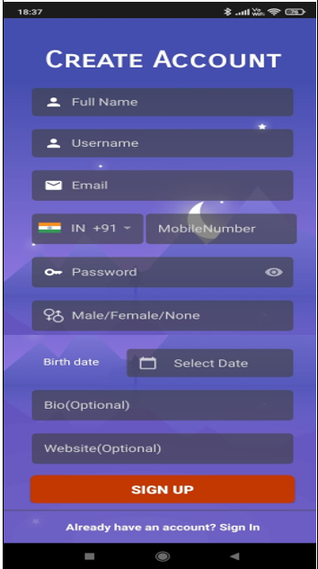
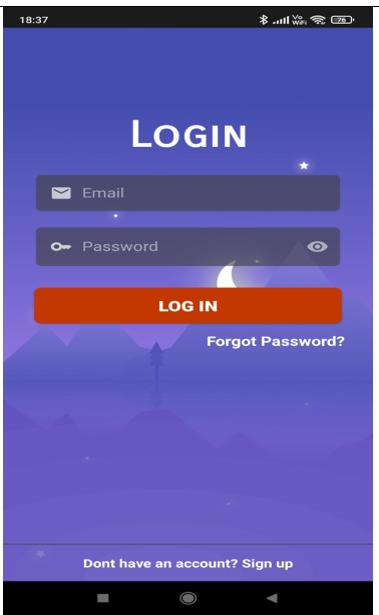
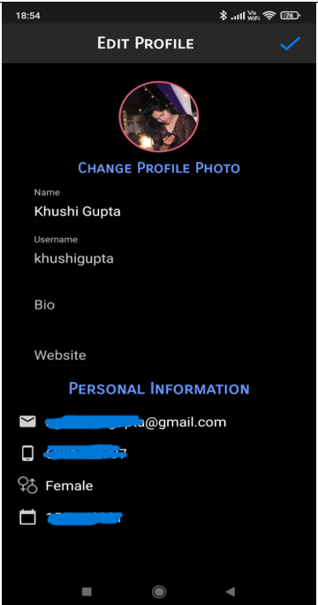

# SnapSocial - A Comprehensive Social Media App

## Overview
SnapSocial is an innovative social media application designed to enhance user engagement and personal development. Built for Android devices using Java in Android Studio, it combines traditional social networking features with a unique "Daily Tip" functionality, offering users a daily dose of wisdom and practical advice. The app fosters social interaction, creativity, and self-improvement in a user-friendly environment.

---

## Installation Guide

1. **Clone the Repository:**
   ```bash
   git clone <repository-url>
   ```

2. **Open the Project in Android Studio:**
   - Ensure Android Studio is installed on your system.

3. **Change the Package Name:**
   - Follow the instructions [here](https://stackoverflow.com/questions/16804093/android-studio-rename-package).

4. **Set Up Firebase:**
   - Create a Firebase project [here](https://console.firebase.google.com/).
   - Connect your project to Firebase using this [guide](https://youtu.be/ggMPCD9hlaQ).

5. **Add Firebase Configuration File:**
   - Download the `google-services.json` file from your Firebase project settings.
   - Place it in the `app/` directory of your project.

6. **Enable Notifications:**
   - Copy the Server Key from `Firebase > Project Settings > Cloud Messaging`.
   - Paste it into the `APIService.java` file.

---

## Key Features

### Core Social Features
- **User Profiles:** Create and edit profiles with profile pictures, bios, and personal details.
- **Photo Sharing:** Upload photos from the camera or gallery, add captions, and tag posts.
- **Likes & Comments:** Interact with posts through likes and comments.
- **Stories:** Share time-limited stories with views tracking.

### Unique Functionalities
- **Daily Tips:** Receive daily motivational messages or advice to inspire personal growth.
- **Search:** Discover users by username.
- **Real-Time Notifications:** Stay updated on likes, comments, followers, and daily tips.

### Accessibility
- **Light and Dark Modes:** Choose between light and dark themes for a comfortable user experience.
- **Offline Capability:** Basic functionalities available offline.

---

## Screenshots
### Registration | Login
| Registration Page | Login Page |
|-------------------|------------|
|  |  |

### Profile | Edit Profile
| Profile Page | Edit Profile Page |
|--------------|-------------------|
|  |  |

### Home Feed
| Home Feed |
|-----------|
|  |

---

## Technology Stack

### Languages
- **Java**

### Tools
- **Android Studio**

### Database
- **Firebase Realtime Database**
  - Stores user data, posts, comments, and notifications.

### Modules and Libraries
- **[Retrofit](https://github.com/square/retrofit):** For API requests.
- **[Glide](https://github.com/bumptech/glide):** For image loading and caching.
- **[StoriesProgressView](https://github.com/shts/StoriesProgressView):** For story animations.
- **[Circle Image View](https://github.com/hdodenhof/CircleImageView):** For circular profile images.
- **[Image Cropper](https://github.com/ArthurHub/Android-Image-Cropper):** For photo cropping.

---

## How to Contribute

1. **Fork the Repository:**
   ```bash
   git fork <repository-url>
   ```

2. **Create a New Branch:**
   ```bash
   git checkout -b feature/your-feature-name
   ```

3. **Commit Changes:**
   ```bash
   git commit -m "Added your-feature-name"
   ```

4. **Push to GitHub:**
   ```bash
   git push origin feature/your-feature-name
   ```

5. **Create a Pull Request:**
   - Submit a pull request for review.

---

